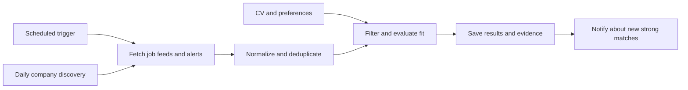

# Personal job-search agent: recommendation and implementation brief

Researched 23 September 2026. This is a design and source review; no service has been deployed or scheduled. Prices are USD before tax and exclude third-party usage unless stated.

Updated after clarification: LinkedIn is the primary required source. A direct unauthenticated HTTP search for “founding engineer” succeeded with status 200 and returned 10 job listing links. This verifies a browser-free public search path in this environment; it does not establish sustained reliability, complete coverage, or parity with signed-in recommendations. The earlier recommendation to make alert emails the principal LinkedIn integration was too restrictive.

## Recommendation

Build a TypeScript search worker with an optional small Next.js dashboard. Use the dashboard for CV upload, editable preferences, results, feedback, and run status. The worker should run independently of page visits and stop after each search.

Make public LinkedIn job search the first source to validate. Start with a small direct HTTP adapter and assess several scheduled runs before selecting it for ongoing operation. If maintaining the adapter becomes burdensome, evaluate a managed provider such as the [Bebity LinkedIn Jobs Scraper on Apify](https://apify.com/bebity/linkedin-jobs-scraper). Its provider documents searches by URL or filters without LinkedIn credentials; that service has not been tested here. Company feeds and startup marketplaces supplement LinkedIn.

If the existing DigitalOcean resource is a Droplet with spare capacity, run the worker there using a systemd timer, with persistent SQLite storage and backups. This is my first choice for a personal tool when that server already exists. The search process runs periodically; the underlying server remains on and billable.

If there is no existing server, my preferred managed alternative is Trigger.dev, with a hosted SQL database. DigitalOcean App Platform scheduled jobs are another good option if keeping everything on DigitalOcean matters. If already paying for Vercel Pro, Vercel Cron plus Workflows is also a reasonable choice.

Next.js is a UI and application framework, not the scheduling service. The same search code can be invoked by a timer, a managed task runner, or a workflow step. Python is also viable, but TypeScript keeps the dashboard and worker in one language.

## Hosting shortlist

| Option | Relevant capability and cost | Assessment for this project |
| --- | --- | --- |
| Existing DigitalOcean Droplet | Run a Node.js process on a systemd timer. Potentially no additional hosting charge if existing capacity suffices; server, backups, and API usage still cost money. | Best starting point if the server already exists and basic server maintenance is acceptable. |
| DigitalOcean App Platform scheduled job | Native cron, minimum interval 15 minutes; jobs are billed only while running. The smallest listed container has a $5/month continuous rate, prorated for runtime. Database and web service are separate. | Good managed option without an idle search worker. [Scheduling](https://docs.digitalocean.com/products/app-platform/how-to/manage-jobs/), [pricing](https://docs.digitalocean.com/products/app-platform/details/pricing/). |
| Trigger.dev | Hosted scheduled TypeScript tasks, retries and run visibility. Free plan includes $5 monthly compute credits and 10 schedules; tasks stop when free credits run out. | My managed default for this small project. [Schedules](https://trigger.dev/docs/tasks/scheduled), [pricing](https://trigger.dev/pricing). |
| Vercel Cron + Workflows | Native Hobby cron is daily; Pro supports minute-level schedules. Pro platform fee is $20/month including one deploying seat and $20 infrastructure credit. Workflows add resumable steps and retries; usage limits and charges still apply. | Good when already on Pro or wanting an integrated Next.js setup. [Cron](https://vercel.com/docs/cron-jobs/usage-and-pricing), [Pro pricing](https://vercel.com/docs/plans/pro-plan), [Workflows](https://vercel.com/docs/workflows). |
| Cloudflare Workers + Workflows | Managed durable workflows with free and paid plans; CPU, requests, state storage, and steps have quotas or charges. | Strong alternative for API-heavy work, but adds a different runtime to learn. [Documentation](https://developers.cloudflare.com/workflows/), [pricing](https://developers.cloudflare.com/workflows/reference/pricing/). |
| Google Cloud Run Jobs + Cloud Scheduler | Run a container on a schedule. | Technically suitable, but additional cloud configuration offers little benefit for this initial personal tool. [Documentation](https://docs.cloud.google.com/run/docs/execute/jobs-on-schedule). |
| n8n | Visual workflows with a Schedule Trigger. | Useful for an email → model → notification prototype; custom source adapters and matching logic are easier for me to maintain in code. [Schedule Trigger](https://docs.n8n.io/integrations/builtin/core-nodes/n8n-nodes-base.scheduletrigger). |

DigitalOcean Functions are a separate product from App Platform scheduled jobs. Its documentation currently lists scheduled function triggers as private preview and a 15-minute function timeout. I would choose the documented App Platform job route over depending on that preview. [Functions limits](https://docs.digitalocean.com/products/functions/details/limits/).

## Accessing jobs without a browser

The constraint is each source's access method, not the AI framework.

**LinkedIn:** its documented self-service API permissions do not include general job search; talent integrations require separate access. Public guest search nevertheless has an unofficial HTTP endpoint that worked in the direct test below. Its availability can change, and LinkedIn restricts unauthorized scraping and automation. [API access](https://learn.microsoft.com/en-us/linkedin/shared/authentication/getting-access), [automated activity](https://www.linkedin.com/help/linkedin/answer/a1340567/automated-activity-on-linkedin?lang=en).

The proof request was a single unauthenticated GET to `https://www.linkedin.com/jobs-guest/jobs/api/seeMoreJobPostings/search?keywords=founding%20engineer&start=0`. It returned HTTP 200, 27,354 decoded characters, and 10 distinct listing links, including this [founding engineer posting](https://www.linkedin.com/jobs/view/founding-engineer-%24150k-%24250k-%2B-0-5%25-1%25-equity-email-inboxes-for-ai-agents-at-coffeespace-4467865731). The individual descriptions and availability were not checked. No browser, LinkedIn login, session cookies, or proxy service was used.

The practical routes are a direct public-search adapter, a maintained scraping library such as [JobSpy](https://github.com/speedyapply/JobSpy), or a managed scraping provider. JobSpy documents LinkedIn support and rate-limit constraints. Compare results and descriptions against a small manual sample before committing. On throttling, back off and report degraded coverage.

Public job search does not reproduce a personalized feed, private messages, or all founder hiring posts. If those are important sources, evaluate them separately through an authenticated browser workflow; this research has not validated unattended signed-in access.

LinkedIn alert emails remain an optional supplementary input. They arrive daily or weekly and cannot supply complete hourly coverage. [Job alerts](https://www.linkedin.com/help/linkedin/answer/a511279).

**Company job boards:** supplement LinkedIn using documented public posting interfaces:

- [Greenhouse Job Board API](https://docs.greenhouse.io/job-board.html): published jobs; GET endpoints require no authentication.
- [Ashby Job Postings API](https://developers.ashbyhq.com/docs/public-job-posting-api): published postings, descriptions, location, and optional compensation, including equity fields when supplied. Exclude entries marked unlisted.
- [Lever Postings API](https://github.com/lever/postings-api): published company postings.

These APIs are company-specific, not a global search engine. Maintain a registry of company board URLs and discover new companies separately. Only ingest the public listing data needed for personal matching, using each source's supported access method and limits.

**Y Combinator:** this brief assumes “Whiteboardinator” means [Work at a Startup / YC Jobs](https://www.ycombinator.com/jobs); that has not been confirmed. It is relevant to the desired startup roles, but I did not find a documented public job-search API in this research. Use indexed pages for discovery, then employer feeds where available. Direct page ingestion needs a source-specific feasibility check; do not promise complete or instant coverage.

**Hacker News:** its [official API](https://github.com/HackerNews/API) exposes job stories and comments. “Who is hiring?” postings live in thread comments, so those require a separate thread adapter from the job-story endpoint.

A web search API can discover new company boards and public opportunities without a browser. For example, [Brave Search API](https://brave.com/search/api/) currently lists $5 per 1,000 Search requests with $5 monthly credits. Search indexing can lag, and search snippets do not establish that a role remains open. Recheck the source before a strong-match alert.

**Wellfound:** another relevant supplementary marketplace. For example, its [Inference founding-engineer listing](https://wellfound.com/jobs/4322382-founding-engineer) explicitly discusses cash/equity compensation and interest in becoming a founder. This illustrates relevance, not suitability for this user: geography, current availability, and CV fit remain unchecked. There is no evidence here that any one alternative will replace the LinkedIn opportunities the user already finds.

## Search objective and matching

Initial objective, derived from the request:

> Find early-stage engineering opportunities with substantial ownership and meaningful equity, prioritizing founding-engineer roles and credible opportunities to grow toward a founder or technical cofounder position.

Store that objective separately from the CV. Extract an editable profile from the CV once, then combine it with explicit preferences. Search neighboring titles such as first engineer, engineer #1, early engineer, founding product engineer, and technical cofounder.

Use hard filters for known constraints: work authorization, geography, remote eligibility, employment type, and salary floor. Do not infer these from a timezone or from the word “remote.” Leave unknown constraints visible for review.

Rank surviving roles using skills, actual responsibilities, company stage, team size, ownership, and equity evidence. A founding-engineer title alone is insufficient. Record numeric equity as stated, retain the source, and mark vague “competitive equity” as unspecified. Treat a path to founder as unconfirmed unless there is evidence; a leadership opportunity and a cofounder offer are distinct outcomes.

Every recommendation should contain the original link, when it was checked, reasons for the match, salary/equity evidence, and unresolved questions. User feedback such as interested, dismiss, wrong location, or insufficient equity should update explicit preferences without inventing CV experience.

## Proposed recurring workflow

1. Discover companies and additional search terms daily, with a fixed query budget.
2. Search public LinkedIn jobs every two hours, subject to source limits, and poll selected company feeds; ingest supplementary alert emails when available.
3. Deduplicate by source ID and canonical URL, then identify cross-source copies. Track first seen, last seen, source timestamps, and material changes.
4. Apply cheap filters first. Ask the model to evaluate only new or materially changed candidates and research a limited shortlist.
5. Save matches and notification intents. Retry temporary failures without sending the same alert again; use provider idempotency where supported.
6. Notify promptly for strong matches; put weaker possibilities in an optional daily digest. Stay quiet when nothing useful changes.

Use a per-search lock to prevent overlapping runs, bounded retries, per-run query/token limits, and a failure alert if successful searches stop. Track source failures separately from “no new jobs.” External job text is input data and must not be allowed to change the worker's instructions or invoke actions.

One-, two-, and three-hour schedules are straightforward. A literal 23-hour interval needs stored next-run times or interval scheduling: a cron hour expression of `*/23` runs at hours 0 and 23 each day, not consistently every 23 hours. Daily digests should use the user's chosen timezone.

## Notifications and costs

Start with email. It fits longer explanations and job links. [Resend](https://resend.com/pricing) is one option, currently offering 3,000 emails/month with a 100/day free-plan limit. Configure the sender and domain as required; use a separate inbox/forwarding flow for incoming LinkedIn alerts.

A [Telegram bot](https://core.telegram.org/bots/api#sendmessage) is an alternative for phone notifications. WhatsApp is possible through its Business Platform or a provider such as Twilio, but requires sender setup and approved templates for notifications outside the 24-hour service window. [Template requirements](https://www.twilio.com/docs/whatsapp/tutorial/send-whatsapp-notification-messages-templates), [message pricing](https://www.twilio.com/en-us/whatsapp/pricing). I would add WhatsApp only if it is the preferred channel.

Illustrative compute estimate: 360 two-minute runs/month on Trigger.dev's Small 1x rate cost approximately $1.47 before credits: `360 × (120 × $0.0000338 + $0.000025)`. This assumes one task invocation per scan and excludes extra tasks, retries, database, model calls, and search. Actual runtime must be measured. [Rates](https://trigger.dev/pricing).

For an initial budget, set separate monthly caps of $10 for model calls and $5 for paid discovery usage, then review measured usage. These are proposed limits, not a forecast or guarantee. Store the CV privately, keep it out of routine logs, and pass only relevant profile fields to search/model providers.

## First implementation milestone

Prove a complete scheduled run with a reviewed profile, real LinkedIn search results and descriptions, deduplication, source-linked matching, and one email notification containing direct LinkedIn job links. Compare search output against a manual LinkedIn sample and verify that repeated runs work and do not resend unchanged matches. Record partial coverage and failures explicitly. Then add supplementary company feeds, startup discovery, and the small Next.js interface.

Inputs still needed before personal matching: the CV, target countries and work authorization, remote/relocation preference, salary floor, what “meaningful equity” means, and the notification destination. Hosting choice depends on whether the existing DigitalOcean resource is a Droplet or another service. No accounts or paid resources were provisioned during this research.
